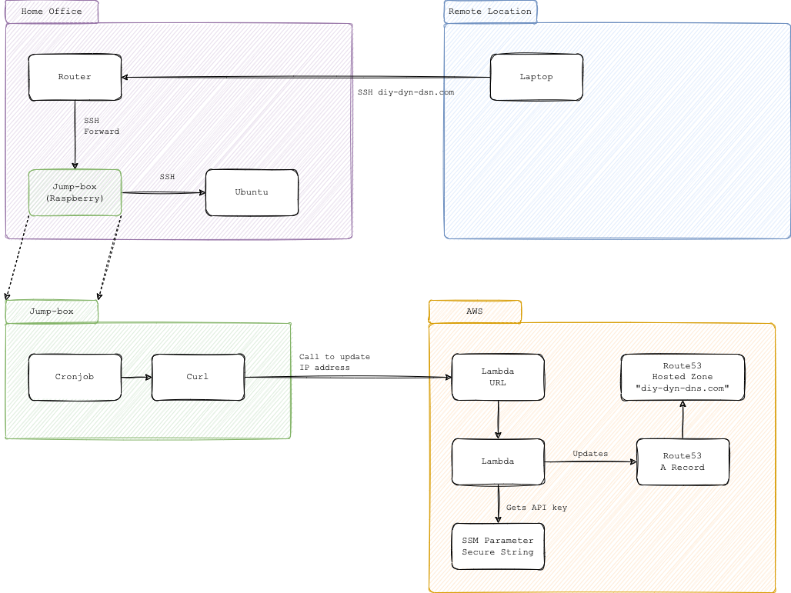

# DIY Dynamic DNS

## How am I using this?



## How much does it cost in terms of AWS services?

The AWS services will cost 6 USD per year, 0.50 USD per month.

You can see the details here: 
https://calculator.aws/#/estimate?id=cbe57b14d97d3bf63a6073d6276dede0cf99b836


If you don't have a domain name, you can by a `.link` domain in AWS for 5 USD
per year.

So, the total cost per year is 11 USD, less than 1 USD per month. 


## Deploy the AWS Service

First create the `terraform.tfvars` inside the `./infra`  folder.

Example:

```hcl
api_key="put-here-a-complex-api-key"
dns_dyn_record_name="the dns record to be used, e.g. dyn.mypersondomain.com"
dns_hosted_zone="the route53 hosted zone id"
```

Then run the following commands:

```sh
export AWS_PROFILE=put-here-your-aws-profile-to-connect-to-aws
make init
make deploy
```

## Configuring the cronjob

Log in into the raspberry and run

```sh
crontab -e
```

Paste the contents of the `./crontab/update-dns.crontab` file.

Copy the `./crontab/update-dns.sh` file to `/home/pi` and give permissions to run:

```sh
chmod 700 update-dns.sh
```

Edit the `/home/pi/.profile` and set the `DIY_DYN_DNS_UPDATE_API_KEY` and 
the `DIY_DYN_DNS_UPDATE_ENDPOINT` environment vars:

```sh
export DIY_DYN_DNS_UPDATE_ENDPOINT=https://your-id-here.lambda-url.eu-west-1.on.aws
export DIY_DYN_DNS_UPDATE_API_KEY=put-here-a-complex-api-key
```

## Generating an API key

You can use `openssl`:

```sh
openssl rand -base64 64
```

## Extra

1. Open the SSH port in your router and redirect to the raspberry SSH port.
2. Confiure SSH keys to facilitate access without password